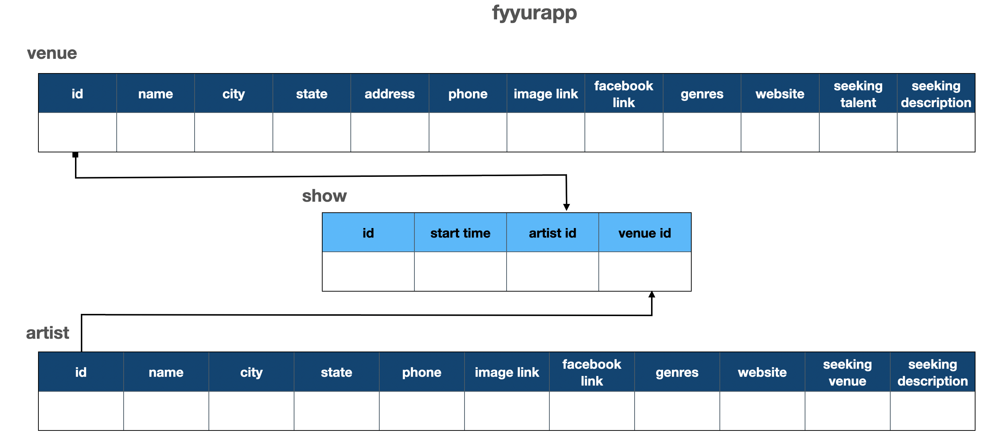

# Fyyur

Fyyur is a musical venue and artist booking site that facilitates the discovery and bookings of shows between local performing artists and venues. This site lets you list new artists and venues, discover them, and list shows with artists as a venue owner.


### Table of Contents

1. [Installation](#installation)
2. [Project Motivation](#motivation)
3. [File Descriptions](#files)
4. [Run](#results)
5. [Licensing, Authors, and Acknowledgements](#licensing)

## Installation <a name="installation"></a>

### A. Dependency
Our tech stack will include the following:
 * **virtualenv** as a tool to create isolated Python environments
 * **SQLAlchemy ORM** to be our ORM library of choice
 * **PostgreSQL** as our database of choice
 * **Python3** and **Flask** as our server language and server framework
 * **Flask-Migrate** for creating and running schema migrations
You can download and install the dependencies mentioned above using `pip` as:
```
pip install virtualenv
pip install SQLAlchemy
pip install postgres
pip install Flask
pip install Flask-Migrate
```
> **Note** - If we do not mention the specific version of a package, then the default latest stable package will be installed. 

### B. Frontend Dependencies
You must have the **HTML**, **CSS**, and **Javascript** with [Bootstrap 3](https://getbootstrap.com/docs/3.4/customize/) for our website's frontend. Bootstrap can only be installed by Node Package Manager (NPM). Therefore, if not already, download and install the [Node.js](https://nodejs.org/en/download/). Windows users must run the executable as an Administrator, and restart the computer after installation. After successfully installing the Node, verify the installation as shown below.
```
node -v
npm -v
```
Install [Bootstrap 3](https://getbootstrap.com/docs/3.3/getting-started/) for the website's frontend:
```
npm init -y
npm install bootstrap@3
```

### C. Install the requirements
```
python -m virtualenv env
source env/bin/activate
pip install -r requirements.txt
```


## Project Motivation<a name="motivation"></a>
- Practice CURD of SQLAlchemy for relational database
- Practice Flask framework 

### Database relations


## File Descriptions <a name="files"></a>
  ```
  ├── README.md
  ├── assets *** description for database relations 
  ├── app.py *** the main driver of the app. Includes your SQLAlchemy models.
                    "python app.py" to run after installing dependences
  ├── config.py *** Database URLs, CSRF generation, etc
  ├── error.log
  ├── forms.py *** Your forms
  ├── requirements.txt *** The dependencies we need to install with "pip3 install -r requirements.txt"
  ├── static
  │   ├── css 
  │   ├── font
  │   ├── ico
  │   ├── img
  │   └── js
  └── templates
      ├── errors
      ├── forms
      ├── layouts
      └── pages
  ```

## Run <a name="results"></a>

### migrations

```
flask db init
```
Create a database
```
createdb fyyurapp
```
Create tables
```
flask db migrate
```
```
flask db upgrade 
```
or
```
flask db downgrade
```
### Run Webapp

```
export FLASK_APP=myapp
export FLASK_ENV=development # enables debug mode
python3 app.py
```

If something goes wrong, error 48.  
```
ps -fA | grep python
kill thread number
```
run python3 app.py again

### Verify on the Browser
Navigate to project homepage [http://127.0.0.1:5000/](http://127.0.0.1:5000/) or [http://localhost:5000](http://localhost:5000) 


## Licensing, Authors, and Acknowledgements <a name="licensing"></a>

### Built With

* [SQLAlchemy](https://docs.sqlalchemy.org/en/14/) - The Python SQL Toolkit and Object Relational Mapper
* [Psycopg2](https://www.psycopg.org/) - Psycopg is the most popular PostgreSQL adapter for the Python.
* [Flask](https://flask.palletsprojects.com/en/1.1.x/) - Python Web development framwork

### Versioning

* We use [SemVer](http://semver.org/) for versioning. For the versions available, see the [tags on this repository](https://github.com/your/project/tags).

### Authors

* **Tom Ge** - *Fullstack egineer* - [github profile](https://github.com/tomgtqq)

### License

* This project is licensed under the MIT License
